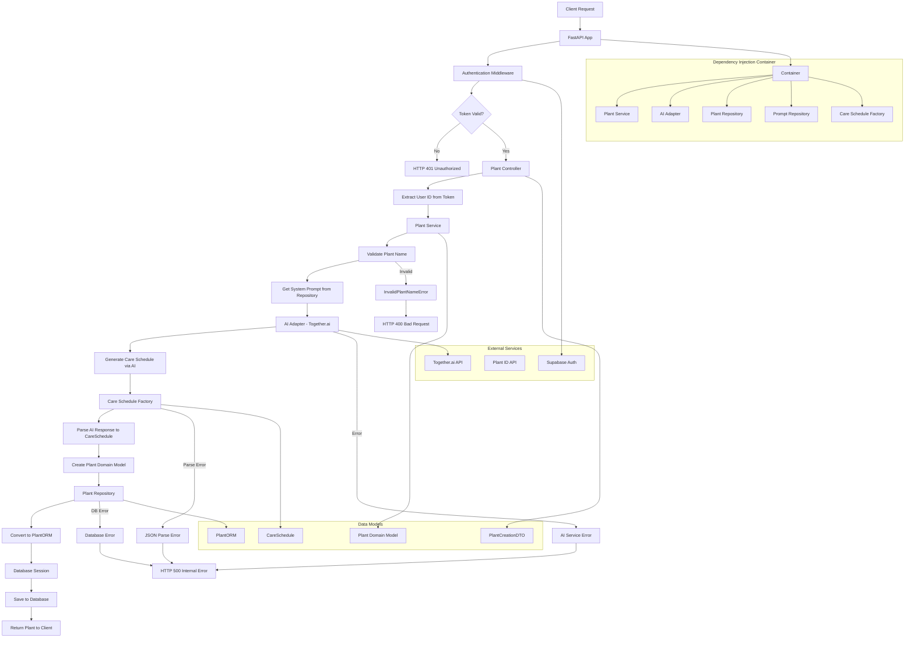

# Plant Care API Execution Flow

## Key Components

### 1. **Entry Point** (`main.py`)
- FastAPI application initialization
- Dependency injection container setup
- Router registration

### 2. **Authentication** (`auth_middleware.py`)
- JWT token verification using Supabase
- User ID extraction from token
- Security validation

### 3. **Controller Layer** (`plant_controller.py`)
- HTTP endpoint handling
- Request/response mapping
- Error handling and HTTP status codes

### 4. **Service Layer** (`plant_service.py`)
- Business logic orchestration
- Plant name validation
- Care schedule generation coordination

### 5. **Adapters** (`ai_adapter.py`, `plant_id_adapter.py`)
- External service integration
- Together.ai for AI completions
- Plant ID API for plant identification

### 6. **Repository Layer** (`plant_repository_impl.py`)
- Data persistence
- Domain model to ORM conversion
- Database operations

### 7. **Factory** (`care_schedule_factory.py`)
- AI response parsing
- JSON to domain model conversion
- Error handling for malformed responses

### 8. **Domain Models**
- `Plant`: Core plant entity
- `CareSchedule`: Plant care instructions
- `PlantCreationDTO`: Request data transfer object

## Execution Flow Details

1. **Request Reception**: Client sends POST request to `/api/v1/plants/`
2. **Authentication**: JWT token validated against Supabase
3. **Controller Processing**: Request mapped to DTO and user ID extracted
4. **Service Orchestration**: Plant service coordinates the creation process
5. **AI Integration**: System prompt retrieved and sent to Together.ai
6. **Response Processing**: AI response parsed into CareSchedule object
7. **Persistence**: Plant entity saved to database via repository
8. **Response**: Created plant returned to client

## Error Handling

- **Authentication Errors**: 401 Unauthorized
- **Validation Errors**: 400 Bad Request  
- **Service Errors**: 500 Internal Server Error
- **Database Errors**: 500 Internal Server Error
